# MMO Game Monitoring System

A high-performance, microservices-based MMO game server with Unity client, featuring real-time UDP networking, intelligent bot systems, and containerized deployment.

## 📋 Table of Contents

- [🏗️ Architecture Overview](#-architecture-overview)
- [🚀 Quick Start](#-quick-start)
- [🎮 Game Features](#-game-features)
- [🤖 Bot Systems](#-bot-systems)
- [🔧 Technical Stack](#-technical-stack)
- [📊 Monitoring & Metrics](#-monitoring--metrics)
- [🛠️ Development Setup](#️-development-setup)
- [🐳 Docker Deployment](#-docker-deployment)
- [📈 Performance Optimization](#-performance-optimization)
- [🔮 Future Roadmap](#-future-roadmap)
- [🤝 Contributing](#-contributing)
- [📄 License](#-license)

## 🏗️ Architecture Overview

This project implements a modern, scalable MMO game server architecture using microservices:

### 🎮 Game Server (`/GameServer`)
- **Purpose**: Core game logic, player connections, UDP networking
- **Technology**: .NET 8, ASP.NET Core, UDP Sockets
- **Ports**: 8080 (HTTP API), 8081 (UDP Game Protocol)
- **Responsibilities**:
  - Player session management
  - Server-authoritative movement with client prediction
  - Real-time state broadcasting (20Hz)
  - Bot integration and synchronization

### 🤖 Bot Server (`/BotServer`)
- **Purpose**: Intelligent bot management and AI coordination
- **Technology**: .NET 8, ASP.NET Core
- **Port**: 8082 (HTTP API)
- **Responsibilities**:
  - Bot container lifecycle management
  - Bot behavior coordination
  - Performance monitoring and scaling

### 📚 Shared Models (`/Shared`)
- **Purpose**: Common data structures and interfaces
- **Technology**: .NET 8 Class Library
- **Contents**: Player states, bot models, DTOs, game mechanics

### 🎨 Unity Client (`/UnityClient`)
- **Purpose**: Game client with real-time networking
- **Technology**: Unity 2022.3+, C#
- **Features**:
  - UDP client networking
  - Client-side prediction
  - Server reconciliation
  - Local physics simulation


## 🚀 Quick Start

### Prerequisites
- Docker & Docker Compose
- Unity 2022.3+ (for client development)
- .NET 8 SDK (for server development)

### 1. Start the Server Stack
```bash
# Clone and navigate to project
git clone <repository-url>
cd MMO-Game-Monitoring-System

# Start all services
docker-compose up --build
```

### 2. Verify Services
```bash
# Check service health
curl http://localhost:8080/health  # Game Server
curl http://localhost:8082/health  # Bot Server
```

### 3. Launch Unity Client
1. Open `UnityClient/UnityClient.sln` in Unity
2. Add `UdpNetworkClient` component to your scene
3. Configure connection settings:
   - Server Host: `localhost`
   - Server Port: `8081`
   - Auto Join: `true`
4. Play the scene


## 🎮 Game Features

### Real-Time Multiplayer
- **Server-Authoritative Movement**: Prevents cheating with server validation
- **Client-Side Prediction**: Smooth, responsive movement with server correction
- **UDP Protocol**: Ultra-low latency networking optimized for gaming
- **State Synchronization**: 20Hz real-time state broadcasting

### Player Mechanics
- **3D Movement**: WASD/Arrow keys for movement
- **Jumping**: Spacebar for jumping with gravity simulation
- **Boundary Enforcement**: Server-enforced world boundaries (-50 to +50 units)
- **Smooth Interpolation**: Client-side interpolation for remote players

### Bot Integration
- **Dynamic Bot Population**: Bots managed by separate Bot Server
- **Real-Time Updates**: Bot positions synchronized with game state
- **Behavior System**: Configurable bot behaviors (Patrol, Random, Idle)
- **Performance Monitoring**: Bot impact tracking and optimization

## 🤖 Bot Systems

### Current Bot System (C# Server-Side)
- **Container-Based Management**: Bots organized in scalable containers
- **Simple Behaviors**: Random movement, patrol patterns, idle states
- **Performance Optimized**: Efficient position updates and state management
- **Monitoring**: Real-time bot statistics and health checks


### Future: Unity-Based Bot System

#### Vision
Revolutionary bot system leveraging Unity's full capabilities for realistic AI:

- **Realistic Physics**: Full Unity physics engine for natural movement
- **Advanced AI**: NavMesh pathfinding, sensory systems, decision trees
- **Visual Authoring**: Create bot behaviors in Unity Editor using familiar tools
- **AssetBundle Distribution**: Package bots as AssetBundles for easy deployment
- **Headless Runtime**: Containerized Unity runtimes for server-side execution

#### Key Advantages
| Current System | Unity-Based System |
|---------------|-------------------|
| Simple position updates | Full physics simulation |
| Limited AI behaviors | Rich sensory capabilities |
| Server-side only | Unity ecosystem integration |
| Basic movement | NavMesh pathfinding |
| Manual behavior coding | Visual authoring in Editor |


### Bot Authoring Workflow

```mermaid
flowchart TD
    A[🎨 Unity Editor] --> B[Create Bot Prefab]
    B --> C[Add AI Scripts]
    C --> D[Configure Sensors]
    D --> E[Setup NavMesh]
    E --> F[Test Behavior]
    
    F --> G{Behavior Working?}
    G -->|No| C
    G -->|Yes| H[Build AssetBundle]
    
    H --> I[Create Manifest]
    I --> J[Validate Package]
    J --> K[Upload to BotServer]
    
    K --> L[Security Scan]
    L --> M{Scan Passed?}
    M -->|No| N[Reject Package]
    M -->|Yes| O[Schedule Runtime]
    
    O --> P[Deploy Container]
    P --> Q[Monitor Performance]
    Q --> R[Scale as Needed]
    
    style A fill:#e1f5fe
    style H fill:#f3e5f5
    style K fill:#e8f5e8
    style P fill:#fff3e0
```



#### Implementation Phases

**Phase 1: Bot Authoring Framework** (Q2 2024)
- [ ] Create Unity bot authoring project (`/BotAuthoring`)
- [ ] Implement base `UnityBot` MonoBehaviour
- [ ] Add NavMesh integration and pathfinding
- [ ] Create example behaviors (Patrol, Chase, Attack, Flee)
- [ ] Build AssetBundle export pipeline

**Phase 2: Server-Side Runtime** (Q3 2024)
- [ ] Create headless Unity runtime project (`/BotRuntime`)
- [ ] Implement AssetBundle loading with validation
- [ ] Add GameServer synchronization (50ms updates)
- [ ] Build Docker containers for headless execution
- [ ] Implement resource limits and sandboxing

**Phase 3: BotServer Integration** (Q4 2024)
- [ ] Add bot package upload API (`POST /api/bots/upload`)
- [ ] Implement package validation and security scanning
- [ ] Create container scheduler for runtime management
- [ ] Add bot lifecycle management (start/stop/scale)
- [ ] Implement monitoring and health checks

**Phase 4: GameServer Integration** (Q1 2025)
- [ ] Add bot position validation and reconciliation
- [ ] Implement bot state broadcasting to clients
- [ ] Add bot-specific game mechanics
- [ ] Performance optimization for high bot counts

**Phase 5: Production & Security** (Q2 2025)
- [ ] Implement comprehensive security scanning
- [ ] Add runtime sandboxing and resource limits
- [ ] Create CI/CD pipeline for bot packages
- [ ] Performance testing and optimization
- [ ] Documentation and community tools

## 🔧 Technical Stack

### Backend Services
- **Runtime**: .NET 8, ASP.NET Core
- **Networking**: UDP sockets for game traffic, HTTP for APIs
- **Serialization**: System.Text.Json with camelCase naming
- **Architecture**: Microservices with shared models

### Unity Client
- **Engine**: Unity 2022.3+
- **Networking**: Custom UDP client with connection management
- **Physics**: Client-side prediction with server reconciliation
- **UI**: Built-in Unity UI system

### Infrastructure
- **Containerization**: Docker & Docker Compose
- **Orchestration**: Docker Compose for local development
- **Monitoring**: Built-in health checks and metrics
- **Development**: Hot reload, live debugging

### Development Tools
- **IDE**: Visual Studio 2022, Unity Editor
- **Version Control**: Git with conventional commits
- **Documentation**: Markdown with embedded diagrams
- **Testing**: Unit tests, integration tests

## 📊 Monitoring & Metrics

### Real-Time Metrics
Access live server metrics at `http://localhost:8080/admin`:

- **Player Statistics**: Active players, connections, regions
- **Bot Metrics**: Bot counts, behaviors, performance impact
- **Server Health**: Memory usage, CPU, response times
- **Network Stats**: Packet rates, latency, throughput

### Health Endpoints
```bash
# Game Server Health
GET http://localhost:8080/health

# Bot Server Health
GET http://localhost:8082/health

# Game State API
GET http://localhost:8080/api/game-state
```

### Performance Monitoring
- **Adaptive Broadcasting**: Throttles updates based on entity count
- **Connection Tracking**: Real-time connection monitoring
- **Resource Usage**: Memory, CPU, and network monitoring
- **Error Tracking**: Comprehensive error logging and reporting

## 🛠️ Development Setup

### Backend Development
```bash
# Navigate to project root
cd MMO-Game-Monitoring-System

# Restore dependencies
dotnet restore GameServer/src/GameServer.csproj
dotnet restore BotServer/src/BotServer.csproj
dotnet restore Shared/Shared.csproj

# Run Game Server
cd GameServer/src
dotnet run

# Run Bot Server (in another terminal)
cd BotServer/src
dotnet run
```

### Unity Client Development
1. Open Unity Hub
2. Add project: `UnityClient/UnityClient.sln`
3. Configure build settings for your platform
4. Add `UdpNetworkClient` to your scene
5. Configure network settings

### Development Workflow
1. **Backend Changes**: Use hot reload with `dotnet watch run`
2. **Unity Changes**: Unity's built-in hot reload
3. **Testing**: Run services locally with `docker-compose up`
4. **Debugging**: Attach debugger to running containers

## 🐳 Docker Deployment

### Local Development
```bash
# Build and run all services
docker-compose up --build

# Run in background
docker-compose up -d --build

# View logs
docker-compose logs -f game-server
docker-compose logs -f bot-server

# Stop services
docker-compose down
```

### Production Deployment
```yaml
# docker-compose.prod.yml
version: '3.8'
services:
  game-server:
    image: mmo-game-server:latest
    ports:
      - "8080:8080"
      - "8081:8081/udp"
    environment:
      - ASPNETCORE_ENVIRONMENT=Production
    deploy:
      replicas: 2
      resources:
        limits:
          memory: 1G
        reservations:
          memory: 512M

  bot-server:
    image: mmo-bot-server:latest
    ports:
      - "8082:8082"
    environment:
      - ASPNETCORE_ENVIRONMENT=Production
```

### Deployment Architecture

```mermaid
graph TB
    %% Define styles
    classDef loadbalancer fill:#ffebee,stroke:#c62828,stroke-width:2px
    classDef server fill:#e8f5e8,stroke:#2e7d32,stroke-width:2px
    classDef storage fill:#fff3e0,stroke:#f57c00,stroke-width:2px
    classDef monitoring fill:#e3f2fd,stroke:#1565c0,stroke-width:2px

    %% Load Balancer
    LB["🌐 Load Balancer
NGINX / Traefik
• SSL Termination
• Rate Limiting
• Health Checks"]
    class LB loadbalancer

    %% Game Servers
    GS1["🎯 Game Server #1
• UDP 8081
• HTTP 8080
• Player Sessions"]
    GS2["🎯 Game Server #2
• UDP 8081
• HTTP 8080
• Player Sessions"]
    class GS1,GS2 server

    %% Bot Server
    BS["🤖 Bot Server
• HTTP 8082
• Bot Management
• AI Coordination"]
    class BS server

    %% Shared Storage
    Redis[("🗄️ Redis Cache
• Session Data
• Bot States
• Metrics")]
    DB[("🗄️ Database
• Game Data
• User Accounts
• Bot Packages")]
    class Redis,DB storage

    %% Monitoring
    PROM["📊 Prometheus
• Metrics Collection
• Alerting"]
    GRAF["📈 Grafana
• Dashboards
• Visualization"]
    class PROM,GRAF monitoring

    %% Connections
    LB --> GS1
    LB --> GS2
    LB --> BS
    
    GS1 --> Redis
    GS2 --> Redis
    BS --> Redis
    
    GS1 --> DB
    GS2 --> DB
    BS --> DB
    
    GS1 --> PROM
    GS2 --> PROM
    BS --> PROM
    
    PROM --> GRAF
```



## 📈 Performance Optimization

### UDP Protocol Benefits
- **Latency**: ~50% faster than WebSocket/TCP
- **Throughput**: Supports 100+ concurrent entities
- **Bandwidth**: Minimal packet overhead
- **Reliability**: Optimized for real-time gaming

### Server Optimizations
- **Adaptive Broadcasting**: Scales update frequency based on load
- **Efficient Serialization**: JSON with camelCase for minimal size
- **Connection Pooling**: Optimized UDP socket management
- **Memory Management**: Efficient object pooling and cleanup

### Client Optimizations
- **Client Prediction**: Smooth movement with server correction
- **Interpolation**: Smooth remote player movement
- **Batching**: Grouped network updates for efficiency
- **Resource Management**: Object pooling for GameObjects

## 🔮 Future Roadmap


### Short Term (3-6 months)
- [ ] Complete Unity-based bot system Phase 1
- [ ] Add comprehensive monitoring dashboard
- [ ] Implement player authentication system
- [ ] Add voice chat support
- [ ] Create admin panel for server management

### Medium Term (6-12 months)
- [ ] Complete Unity bot system Phases 2-3
- [ ] Add world persistence and database integration
- [ ] Implement matchmaking system
- [ ] Add modding support for custom content
- [ ] Create mobile client version

### Long Term (1-2 years)
- [ ] Complete full Unity bot system
- [ ] Add VR/AR support
- [ ] Implement cross-platform play
- [ ] Create content creation tools
- [ ] Build community features and marketplace

### Technical Improvements
- [ ] Migrate to Kubernetes for orchestration
- [ ] Add Redis for shared state management
- [ ] Implement event sourcing for game state
- [ ] Add machine learning for bot behavior optimization
- [ ] Create comprehensive testing framework

## 🤝 Contributing

### Development Guidelines
1. **Code Style**: Follow C# coding conventions
2. **Commits**: Use conventional commit format
3. **Testing**: Add unit tests for new features
4. **Documentation**: Update README for significant changes
5. **Reviews**: All PRs require code review

### Getting Started
1. Fork the repository
2. Create a feature branch
3. Make your changes
4. Add tests if applicable
5. Submit a pull request

### Areas for Contribution
- Unity client improvements
- Bot AI development
- Performance optimizations
- Documentation improvements
- Testing and CI/CD

## 📄 License

This project is licensed under the MIT License - see the [LICENSE](LICENSE) file for details.

---

## 📞 Support & Community

- **Issues**: [GitHub Issues](https://github.com/your-repo/issues)
- **Discussions**: [GitHub Discussions](https://github.com/your-repo/discussions)
- **Documentation**: [Wiki](https://github.com/your-repo/wiki)

## 🙏 Acknowledgments

- Unity Technologies for the amazing game engine
- Microsoft for .NET and ASP.NET Core
- Docker for containerization technology
- The open-source community for invaluable tools and libraries

---

*Built with ❤️ for the gaming community*
